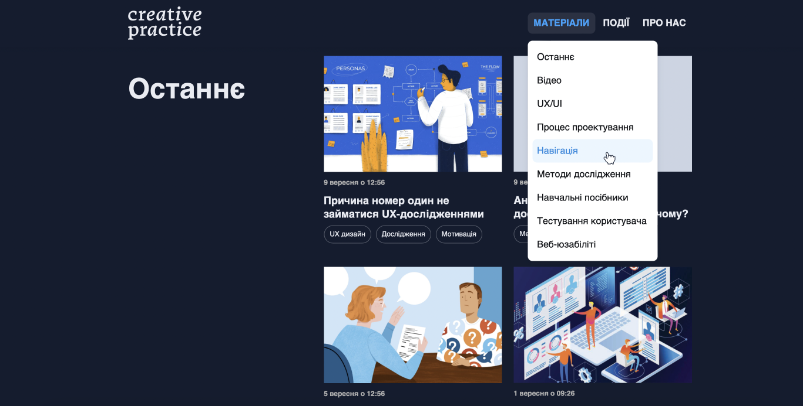

# A blog page with a list of materials: case study for Creative Practice #2

## The outlines
As a UX/UI designer, it was important for me to learn the basics of the front-end for my work to:
- Build better ideas based on feasible solutions
- Know the potential boundaries, what’s possible/impossible to create
- To be more effective in working with the development team and understand their language

I started studying at Creative Practice and have already learned Visual Studio Code, the basic principles of HTML, and some tags. Also, I have found out how to connect CSS, make tables, and work with the block model, CSS selectors, pseudo-classes, pseudo-elements, and cross-platform.

In this lesson, I got acquainted with the flexboxes, grids, and position of elements.

## The goal
Learn flexboxes, grids, and how to work with the position of elements. Create a blog page with a list of materials.

## The process and the result
1. I created the blog page based on a design layout.
2. With the help of a grid, I have developed lists of posts blog with headings.
3. I applied a sticky position for headings, a fixed position for page header, and an absolute position for submenus.
